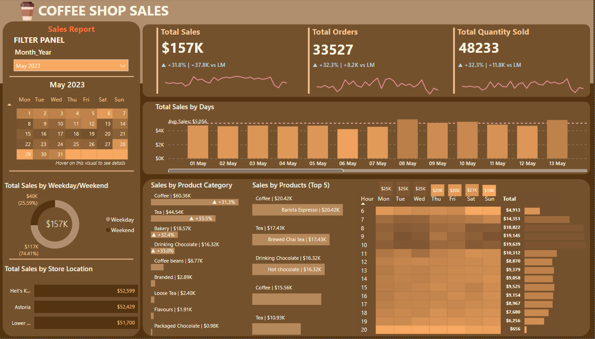

<h1 align="center">
     :coffee: Coffee Shop Sales - Dashboard in Power BI
       
      

     📊 Data Visualization
</h1>
<h3>📚 About Data</h3>

Transaction records for Maven Roasters, a fictitious coffee shop operating out of three NYC locations. Dataset includes the transaction date, timestamp and location, along with product-level details.

📍 The dataset is available via the following link: <a href="https://www.kaggle.com/datasets/ahmedabbas757/coffee-sales?select=Coffee+Shop+Sales.xlsx">Kaggle Link</a>.
<h3>📌 Objectives</h3>

Using Power BI, a dashboard was created to visualize by month: 

<ul>
  <li><b>Total Sales</b></li>
  <li><b>Total Orders</b></li>
  <li><b>Total Quantity Sold</b></li>
  <li><b>Sales Analysis by Weekdays and Weekends</b></li>
  <li><b>Sales Analysis by Store Location</b></li>
  <li><b>Daily Sales with Average Line</b></li>
  <li><b>Sales Analysis by Product Category</b></li>
  <li><b>Top 5 best seller Products</b></li>
  <li><b>Sales Analysis by Days and Hours</b></li>
</ul>

<h3>Conclusion</h3>

<b>Total Sales:</b> Displayed as $157K, with percentage growth (+31.8%) and absolute growth (+$37.8K) compared to the last month (LM).

<b>Total Orders:</b> 33,527 orders, showing a +32% increase (+8.2K vs. LM).

<b>Total Quantity Sold:</b> 48,233 units sold, with a +32.3% growth (+11.8K vs. LM).

<b>Total Sales by Day:</b> A bar chart shows daily sales with an average line of $5,056 for reference.

<b>Sales by Weekday vs. Weekend:</b> A donut chart indicates 74.41% of sales are from weekdays ($117K), and 25.59% ($40K) are from weekends.

<b>Total Sales by Store Location:</b> A bar chart lists contributions by store locations: Hell's Kitchen ($52,599), Astoria ($52,429), and Lower East Side ($51,700).

<b>Sales by Product Category:</b> A detailed breakdown shows categories like coffee ($60.36K, +31.3%), tea ($44.54K, +33.5%), and bakery items ($18.57K, +32.4%).

<b>Top 5 Products:</b> A list of best-sellers such as Barista Espresso ($20.42K), Brewed Chai Tea ($17.43K), and Hot Chocolate ($16.32K).

This dashboard provides an efficient overview of sales trends, product performance, and store contributions, empowering stakeholders to make data-driven decisions.

